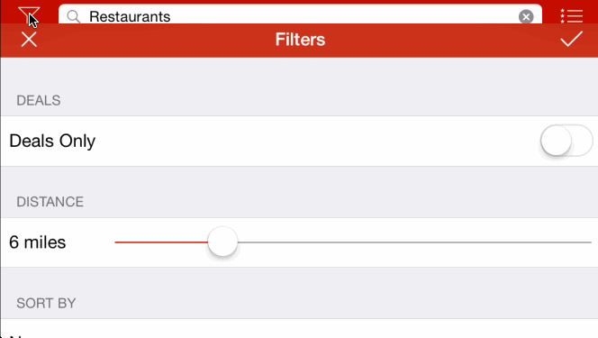

## Yelp

This is a Yelp search app using the [Yelp API](http://developer.rottentomatoes.com/docs/read/JSON).

Time spent: `20`

### Features

#### Required

- [x] Search results page
   - [x] Table rows should be dynamic height according to the content height
   - [x] Custom cells should have the proper Auto Layout constraints
   - [x] Search bar should be in the navigation bar (doesn't have to expand to show location like the real Yelp app does).
- [x] Filter page. Unfortunately, not all the filters are supported in the Yelp API.
   - [x] The filters you should actually have are: category, sort (best match, distance, highest rated), radius (meters), deals (on/off).
   - [x] The filters table should be organized into sections as in the mock.
   - [x] You can use the default UISwitch for on/off states. Optional: implement a custom switch
   - [x] Clicking on the "Search" button should dismiss the filters page and trigger the search w/ the new filter settings.
   - [x] Display some of the available Yelp categories (choose any 3-4 that you want).

#### Optional

- [x] Search results page
   - [x] Infinite scroll for restaurant results
   - [x] Implement map view of restaurant results
- [x] Filter page
   - [ ] Radius filter should expand as in the real Yelp app
   - [x] Categories should show a subset of the full list with a "See All" row to expand. Category list is here: http://www.yelp.com/developers/documentation/category_list (Links to an external site.)
- [x] Implement the restaurant detail page.

#### Additional

- [x] Using NSUserDefaults to remember the filters
- [x] Parallax view in details page (too bad there is no highres image)
- [x] Custom map pin (draws index from list view on the pin for the top 10)
- [x] Map view accessory button to take you to the details page
- [x] Map view with one pin on the details page
- [x] Custom navigation bar icons
- [x] Slider for distance filter
- [x] Collapsable Sort-By filter
- [x] Top categories + any selected ones visible by default in category filter before expansion
- [x] Limiting to one network request in flight
- [x] Works well in Landscape orientation
- [x] Light-color status bar
- [x] Progress HUD and Network error (like rotten tomatoes)

### Walkthrough

GIF created with [LiceCap](http://www.cockos.com/licecap/).

Credits
---------
* [AFNetworking](https://github.com/AFNetworking/AFNetworking)
* [APParallaxHeader](https://github.com/apping/APParallaxHeader)
* [SVProgressHUD](https://github.com/TransitApp/SVProgressHUD)