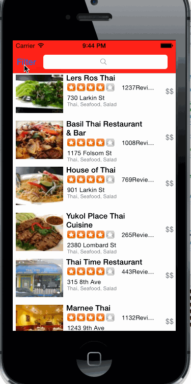

Overview: Build a Yelp search app.

Time taken: 15 hrs.

User stories done:

Search results page
- Custom cells should have the proper Auto Layout constraints
- Search bar should be in the navigation bar (doesn't have to expand to show location like the real Yelp app does).

Filter page. Unfortunately, not all the filters are supported in the Yelp API.
- The filters you should actually have are: category, sort (best match, distance, highest rated), radius (meters), deals (on/off).
- The filters table should be organized into sections as in the mock.
- Categories should show a subset of the full list with a "See All" row to expand. - I show all.
- adding a line here for comment

