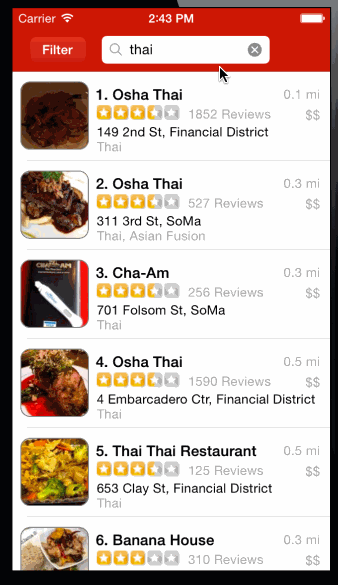

#ios_yelp

A simple iOS yelp search app

##Time spent: 10 + 5 hrs

##Requirements:

   * Search results page
      [x] Custom cells should have the proper Auto Layout constraints
      [x] Search bar should be in the navigation bar (doesn't have to expand to show location like the real Yelp app does).
      * Optional: Table rows should be dynamic height according to the content height
      * Optional: infinite scroll for restaurant results
      * Optional: Implement map view of restaurant results
   * Filter page. Unfortunately, not all the filters are supported in the Yelp API.
      [x] The filters you should actually have are: category, sort (best match, distance, highest rated), radius (meters), deals (on/off).
      [x] The filters table should be organized into sections as in the mock.
      [x] You can use the default UISwitch for on/off states. Optional: implement a custom switch
      * Radius filter should expand as in the real Yelp app
      [x] Categories should show a subset of the full list with a "Show All" row to expand and "Show Less" to collapse. Category list is here: http://www.yelp.com/developers/documentation/category_list
      [x] Clicking on the "Search" button should dismiss the filters page and trigger the search w/ the new filter settings.
   * Optional: Implement the restaurant detail page.

##Screencast

###Search screen

Users enter search keywords and get a list of businesses. Users can use the Filter page to enter filters and fine tune the search result. The settings and last search can survive view change and app restart.

